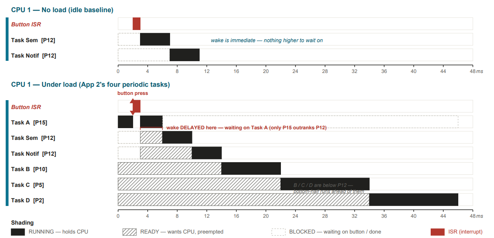
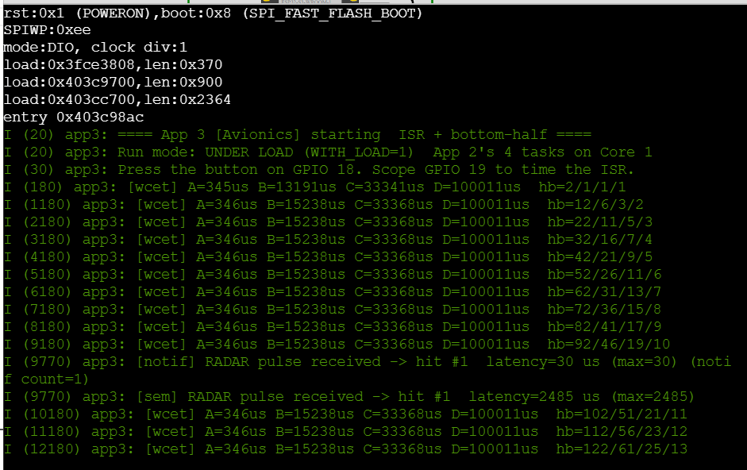
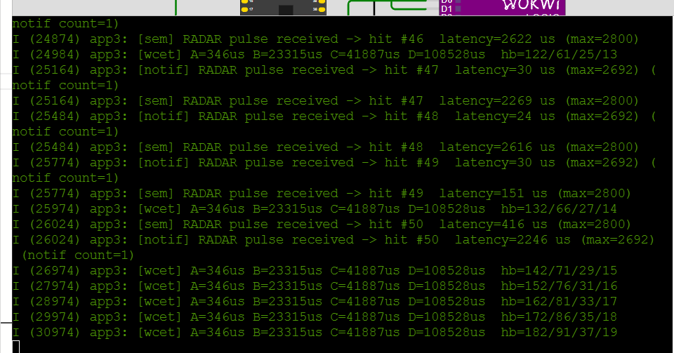
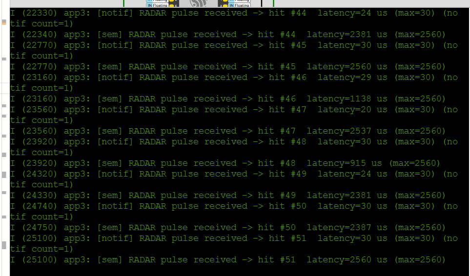
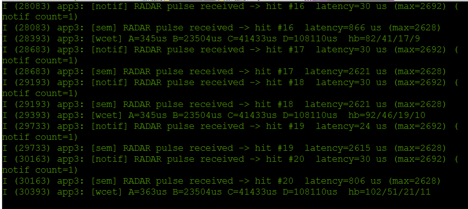
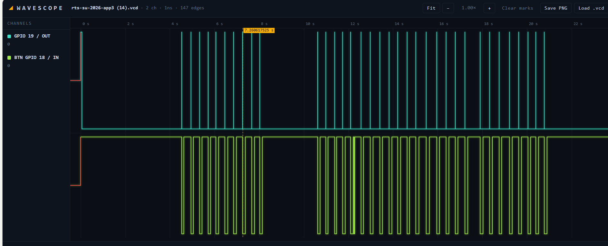
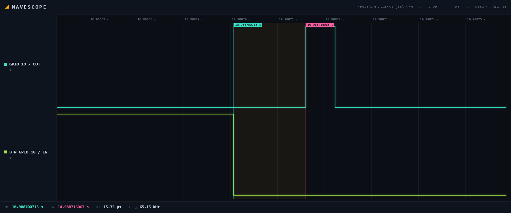

# Avionics ISR Latency Bench

EEE 4775 Real-Time Systems, Final Integration Capstone, Summer 2026
Aaron Ways

An instrumented interrupt path that shows a radar pulse handler still responds in about 15 microseconds while a rate-monotonic avionics workload runs on the same core.

Wokwi project: `WAYS-FINAL-RTS26Summer`

---

## 1. Project overview

A radar return comes in as a hardware interrupt. The ISR does the minimum work it is allowed to do, which is the timestamp, the debounce gate, and the signal, then hands the actual response off to a lower priority task. Four periodic avionics tasks keep running on the same core the whole time. The question this bench answers is what actually delays the response, the signaling mechanism or the priority ladder.

Configuration under test:

- Button on GPIO 18, internal pull-up, negative edge interrupt, 200 us debounce gate.
- An `IRAM_ATTR` ISR raises a scope pulse on GPIO 19, timestamps entry, and signals two bottom halves. One uses a binary semaphore and one uses a direct task notification, so both paths can be compared on the same event.
- Both bottom half tasks run at priority 12, pinned to Core 1.
- Four periodic load tasks pinned to Core 1 on a rate-monotonic ladder. Priorities 15 / 10 / 5 / 2 at periods 100 / 200 / 500 / 1000 ms.
- Two compile time switches. `WITH_LOAD` brings the load fixture online and `BREAK_YIELD` removes the context switch request from the ISR.

Load task A at priority 15 is the only task in the fixture that outranks the bottom halves at 12. B, C and D at 10, 5 and 2 do not. Only one task can delay a wake, and the cost of that delay is bounded by A's own execution time.

Headline results:

| Measurement | Value |
|---|---|
| Interrupt response, button edge to ISR pulse | 15.35 us |
| Bottom half wake latency, idle | 20-30 us |
| Total utilization | U = 0.246 |
| RM bound, n = 4 | 0.757 |

---

## 2. Demo video

<!-- Replace the line below with your embed:
<iframe width="720" height="405" src="https://www.youtube.com/embed/VIDEO_ID" title="Capstone demo" frameborder="0" allowfullscreen></iframe> -->

Video link: https://www.youtube.com/watch?v=kPYCDlbX0vQ&feature=youtu.be

---

## 3. System architecture diagram



Running holds the CPU. Ready wants the CPU and has been preempted. Blocked is waiting on the button or done for the period.

Control flow is one hop. The GPIO edge fires the ISR. The ISR timestamps entry into `isr_entry_time_us`, checks the debounce gate, then calls both `xSemaphoreGiveFromISR` and `vTaskNotifyGiveFromISR` before requesting a context switch. Each bottom half unblocks, reads the shared entry timestamp, works out its own wake latency, updates a running maximum, and logs. Nothing else crosses between interrupt context and task context.

One thing the diagram does not show. `gpio_install_isr_service()` is called from `app_main`, which runs on Core 0, so the interrupt gets allocated on Core 0 while both bottom halves are pinned to Core 1. Every wake in this build is a cross core wake. That does not change the priority argument, since the bottom halves still contend with the load fixture on Core 1, but it is the reason the fault injection in question 4 produces no visible failure.

---

## 4. Task table and WCET evidence

Execution times are measured on target with `esp_timer_get_time()` bracketing each task body, sampled into a running maximum. Periods are the values in the shipped firmware.

| Task | Priority | T (ms) | C (us) | U = C/T | Work |
|---|---|---|---|---|---|
| load_a | 15 | 100 | 346 | 0.0035 | xorshift32 |
| load_b | 10 | 200 | 15238 | 0.0762 | 32-tap FIR |
| load_c | 5 | 500 | 33368 | 0.0667 | CRC-32, 4 KiB |
| load_d | 2 | 1000 | 100011 | 0.1000 | insertion sort, N=400 |
| **Total** | | | | **0.246** | RM bound 0.757 |

U = 0.246 is less than 4(2^(1/4) - 1) = 0.757, so the set is schedulable under both rate-monotonic and EDF, treating the tasks as independent and periodic with deadline equal to period. Heartbeat ratios of 182 / 91 / 37 / 19 at t = 18.18 s confirm the periods from the logs. These times are Wokwi simulated, so they are internally consistent and reproducible but not silicon accurate.

| Configuration | Notification (us) | Semaphore (us) | Presses |
|---|---|---|---|
| Idle, `WITH_LOAD 0` | 30 | 2560 | 51 |
| Loaded, `WITH_LOAD 1` | 2692 | 2800 | 50 |
| Loaded, `BREAK_YIELD 1` | 2692 | 2628 | 20 |

The 15.35 us figure and the 20-30 us figure measure different windows. The analyzer spans button edge to ISR pulse, covering hardware edge detection, the debounce comparison and the ISR prologue. The serial figure spans ISR entry to the bottom half running. The first is interrupt response, the second is wake latency.

### Evidence



WCET and heartbeats. Ratios 182 / 91 / 37 / 19 confirm the periods. B's first sample reads 13191 us before settling at 15238, which is the cold cache on the first iteration.



Loaded run, 50 presses. The run order flip at hits #49 and #50 is where the measurement artifact moves from one path to the other.



Idle baseline. Notification holds 30 us while the semaphore column scatters between 915 and 2560 us.



Yield removed, under load. Per press notification latency stays at 24-30 us, so the predicted failure does not appear.



Full capture, 147 edges. Every button edge produces exactly one ISR pulse, so no presses were missed and the debounce gate never double triggered.



Cursor measurement at t = 10.9887 s. Delta T is 15.35 us from button edge to ISR pulse. The same value appears at 11.3887 s and 15.0211 s, because the simulator models the interrupt entry path with fixed timing. Real hardware would show a distribution.

---

## 5. Engineering analysis

### 1. What is in the ISR, and what is not

**Kept**

1. `int64_t now = esp_timer_get_time();` is the timestamp read. It is ISR safe, and both the debounce gate and the latency measurement need it.
2. `if (now - last_edge_us < DEBOUNCE_US) return; last_edge_us = now;` is the debounce gate. It rejects contact bounce so one press counts as one event, and it has to run before any signaling.
3. `isr_entry_time_us = now; presses_observed++;` are the single word writes that the bottom halves read.
4. `BaseType_t higher_woken = pdFALSE;` is the wake flag the `FromISR` API requires.
5. `xSemaphoreGiveFromISR()` and `vTaskNotifyGiveFromISR()` are what the ISR exists to do. They flag that work is needed, and they are the ISR safe variants.
6. `portYIELD_FROM_ISR(higher_woken);` requests the context switch on return if a higher priority task became ready. This is also the line removed for the failure test in question 4.

**Removable**

1. `gpio_set_level(ISR_PULSE_GPIO, 1/0)` is not needed for function. It exists so the logic analyzer can see ISR entry and exit, costs about 13 us of pulse width, and would come out of a shipping build.

**Not included**

1. No `printf` or `ESP_LOGI`, since logging takes a UART mutex and taking a mutex from an ISR is undefined behavior.
2. No I2C or other bus reads, since those block for milliseconds.
3. No `malloc`, no `vTaskDelay`, no heavy computation. All of that belongs in the bottom half.

### 2. Binary semaphore against direct task notification

The reported maximums say notification wins easily, 30 us against 2560 us when idle. That comparison does not hold up, and the instrumentation is the reason why.

Both bottom halves subtract from the same `isr_entry_time_us`. They run at the same priority, so they go one after the other, and whichever one runs second has the other task's `ESP_LOGI` sitting inside its measured window.

The idle run makes this clear. Notification holds 20-30 us across all 51 presses, while the semaphore column scatters across 915, 1138, 2381, 2387, 2537 and 2560 us. A real mechanism cost would be close to constant, not spread over 1.6 ms on an otherwise idle core. At hits #49 and #50 of the loaded run the order flips, and notification becomes the path reading 2246 us while the semaphore reads 151 and 416 us.

So the real wake latency is 20-30 us on both paths, and the difference between the two mechanisms is smaller than this instrument can resolve. Direct notification should still be cheaper in principle, since it writes the target task's notification value directly instead of going through a separate queue object, but this bench cannot show that. Claiming an 85x advantage from these numbers would be wrong. Measuring it properly needs per path timestamps and the log moved outside the timed window.

### 3. Latency under load, and which task is responsible

Notification's worst case goes from 30 us idle to 2692 us loaded, about 90x. The obvious answer is that load task A caused it, since A at priority 15 is the only task in the fixture that outranks the bottom halves at 12.

The measured WCET says that is not possible. A runs for 346 us. One instance of A cannot produce a 2692 us delay, since it is short by a factor of about eight. B, C and D at priorities 10, 5 and 2 cannot preempt the bottom halves at all, so they contribute nothing. The worst case blocking the load fixture can cause is bounded by C_A = 346 us, and the remaining 2.3 ms is the same print order problem from question 2.

There is separate evidence the ladder works as designed. While presses are happening, the measured times for B, C and D go up. B goes from 15238 to 23315 us, C from 33368 to 41887, and D from 100011 to 108528. A stays at exactly 346 across four separate runs. `MEASURE_WCET` brackets wall clock time, so for B, C and D it counts preemption by the priority 12 bottom halves as if it were execution time. Nothing in this system preempts A, so A's number is a true WCET while the other three are response times with interference included. The table reports the quiescent values.

### 4. Induced failure

**Rule broken.** `portYIELD_FROM_ISR(higher_woken)` removed, after a `FromISR` primitive had already reported that a higher priority task became ready. Built with `BREAK_YIELD 1`.

**Predicted.** The wake gets delivered but nothing acts on it until the next scheduler tick, turning a microsecond scale response into a millisecond scale one.

**Observed.** Nothing changed. Per press latency stayed at 24-30 us and the reported maximum stayed at 2692 us, identical to the build with the yield in place.

**They do not match, and core placement is the reason.** `gpio_install_isr_service()` runs from `app_main` on Core 0, so the interrupt is allocated on Core 0 while both bottom halves are pinned to Core 1. A local yield request only affects the core the ISR is running on. Waking a task on the other core does not use it. ESP-IDF raises an interprocessor interrupt against Core 1, and Core 1 reschedules whether or not `portYIELD_FROM_ISR` was called. In this configuration the line is dead code, which is why removing it changes nothing.

To make the failure visible, install the ISR service from a task pinned to Core 1 so the interrupt and its bottom halves are on the same core. The yield then governs the wake, and removing it should push the response out to the next tick. That is a prediction, not a measurement. The build here keeps the original Core 0 placement.

---

## 6. Hazard analysis and standard mapping

Hazards are assessed the way ARP4761 does it. Identify the failure condition, its effect at system level, and the mitigation. Software objectives are framed against DO-178C. These references are indicative and would need checking against the controlled documents before use in a real certification package.

| Hazard | Cause | System effect | Mitigation | Standard |
|---|---|---|---|---|
| Missed pulse | A binary semaphore carries no count, so a second edge arriving during service is dropped | Radar returns undercounted, with no indication | The notification path preserves a count. Not mitigated on the semaphore path | DO-178C robustness testing, ARP4761 functional hazard assessment |
| Double count from bounce | Mechanical bounce inside one press produces several edges | Returns overcounted, giving false target density | 200 us debounce gate before any signaling, verified across 147 captured edges | DO-178C low level requirement verification |
| Deadline miss on the response path | Higher priority periodic work blocks the bottom half | A return is acknowledged late | Only priority 15 outranks the handler, bounding blocking at 346 us. U = 0.246 against an RM bound of 0.757 | ARP4761 quantitative assessment, rate-monotonic schedulability |
| Lost context switch request goes undetected | A missing `portYIELD_FROM_ISR` is masked by cross core wake behavior | A latent defect ships, because one core configuration cannot expose it | None. Documented as a known gap needing a same core test configuration | DO-178C structural coverage |

---

## Build and run

Open the Wokwi project and press the green button on GPIO 18. Serial output carries per press latency for both paths, and GPIO 19 carries the scope pulse. Add a logic analyzer on D0 and D1 to reproduce the delta T measurement.

```
idf.py set-target esp32s3
idf.py build
idf.py -p /dev/ttyUSB0 flash monitor

idf.py build -DWITH_LOAD=1      # background load on Core 1
idf.py build -DBREAK_YIELD=1    # fault injection
```

Source: [firmware/main.c](firmware/main.c), [firmware/diagram.json](firmware/diagram.json)

---

## AI disclosure

Claude (Anthropic) was used on this capstone. It reviewed the App 3 firmware and found three defects in the version I had submitted, directed the measurement campaign, identified the shared timestamp instrumentation artifact, caught an arithmetic error in my original attribution of the loaded latency to load task A, proposed the cross core explanation for the fault injection result, and drafted this write-up. All measurements are mine, taken from the runs shown above.

